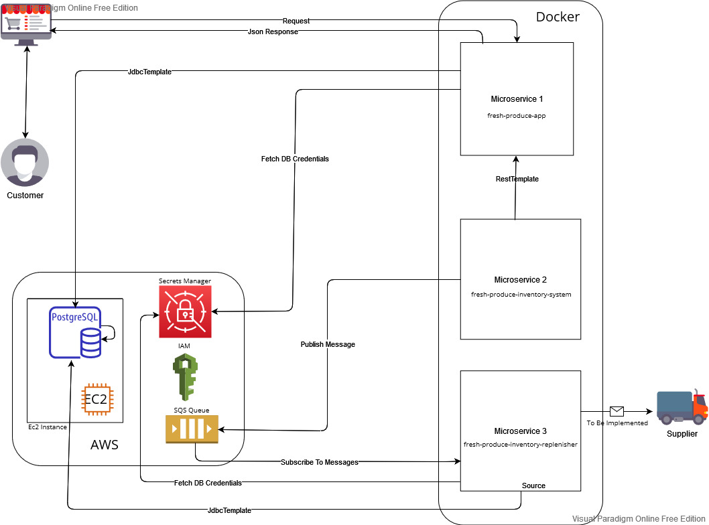

# Introduction
The fresh produce system consists of 3 dockerized microservices written using Spring Boot that interact with different AWS 
Services: [Secrets Manager](https://aws.amazon.com/secrets-manager/), [SQS](https://aws.amazon.com/sqs/), [IAM](https://aws.amazon.com/iam/)
and is backed up by a [Postgres](https://www.postgresql.org/) DB instance running on an AWS [EC2](https://docs.aws.amazon.com/AWSEC2/latest/UserGuide/concepts.html) Instance. 

## Architecture Diagram 

### Microservice 1 - fresh-produce-app
* Written using Spring Boot.
* Exposes a controller that allows for the querying of items in the fresh produce inventory. 
* Uses a JdbcTemplate to interact with the Postgres DB instance deployed on EC2. 
* IAM was used to create a user with the necessary permissions for fetching credentials from a Secrets Manager. 
* The credentials needed for authentication to database is obtained from AWS Secrets Manager. 
* Application is dockerized. 

### Microservice 2 - fresh-produce-inventory-system
* Written using Spring Boot.
* Uses a RestTemplate that allows for the querying of items through controller methods exposed in the fresh-produce-app.
* Publishes a message to the SQS queue using the AWS SDK. 
* IAM was used to create a user with the necessary permissions for publishing messages to a SQS Queue.
* Application is dockerized. 

### Microservice 3 - fresh-produce-inventory-replenisher
* Written using Spring Boot.
* Uses the Spring @Scheduled functionality to repeatedly poll for messages in the SQS queue.
* Processes the messages and then sends an email to the supplier to replenish the items **yet to be implemented**.
* Uses a JdbcTemplate to update the item inventory maintained in the Postgres DB.
* The credentials needed for authentication to database is obtained from AWS Secrets Manager.
* IAM was used to create a user with the necessary permissions for fetching credentials from a Secrets Manager.
* IAM was used to create a user with the necessary permissions for subscribing to messages from a SQS Queue.
* Application is dockerized.

